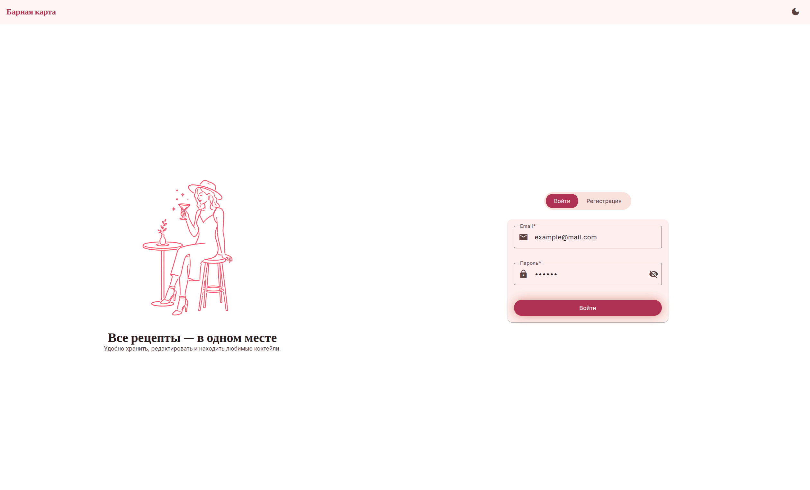
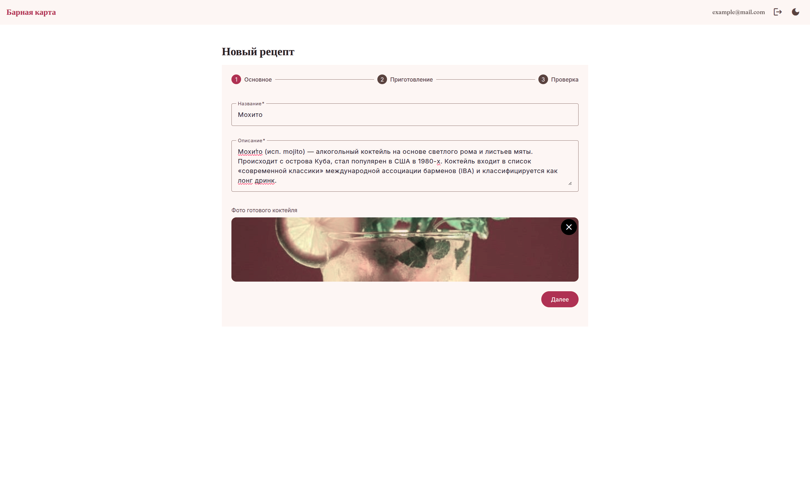
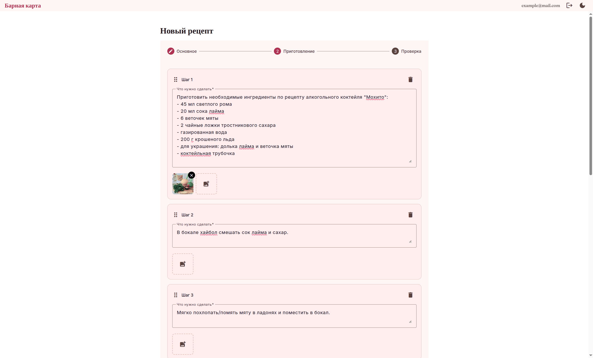
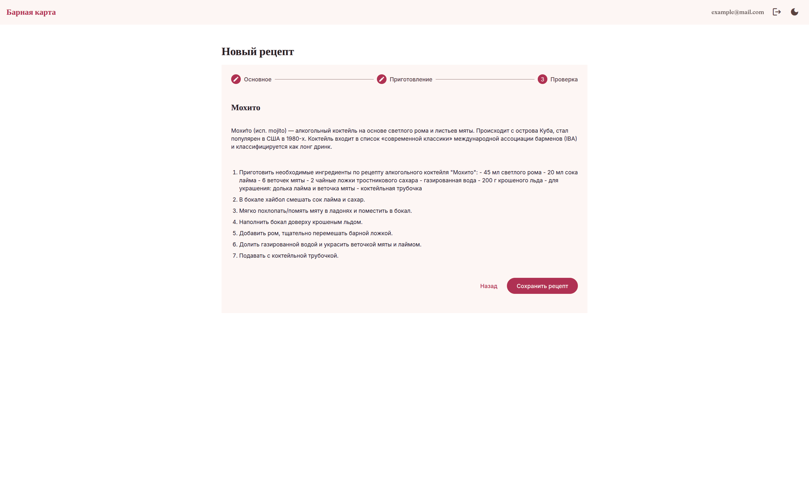
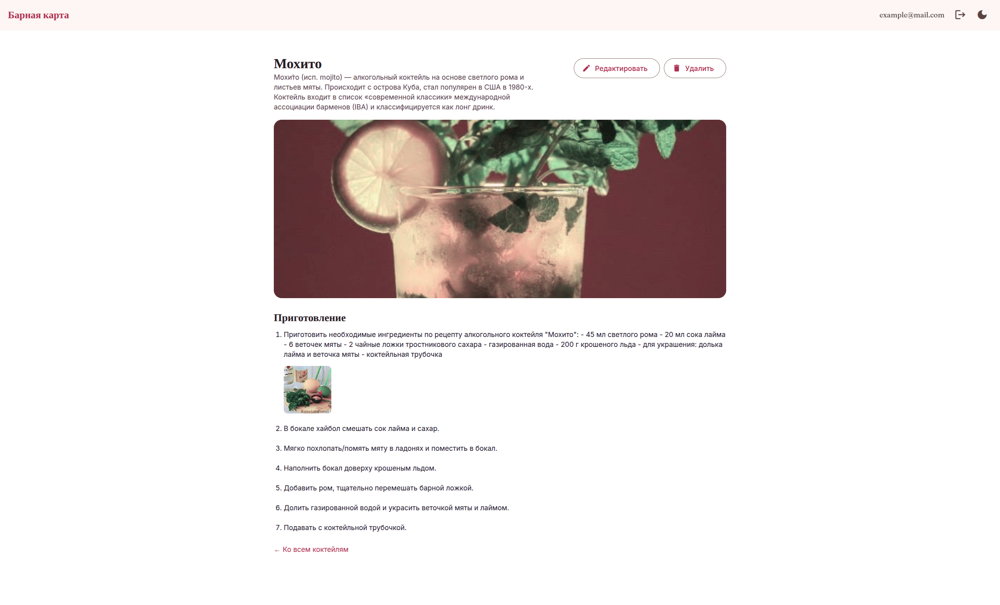
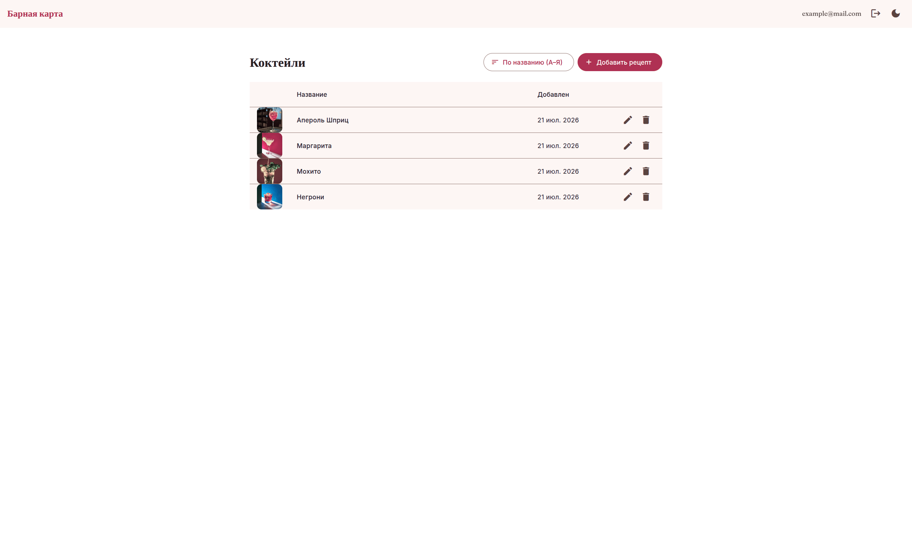
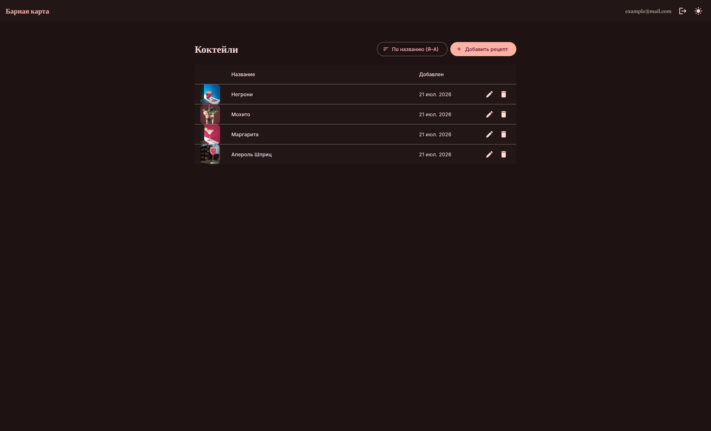
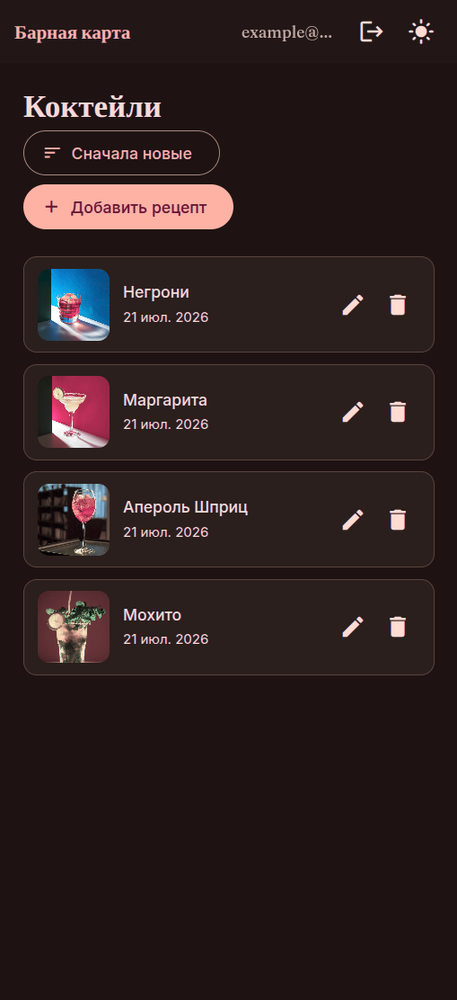
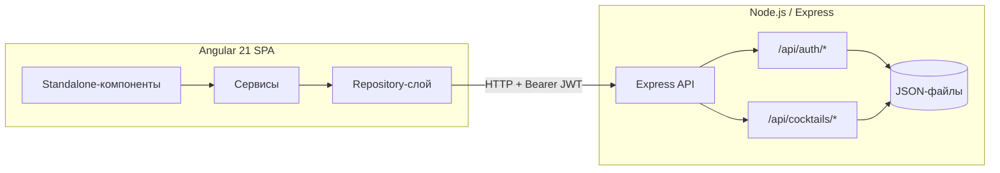
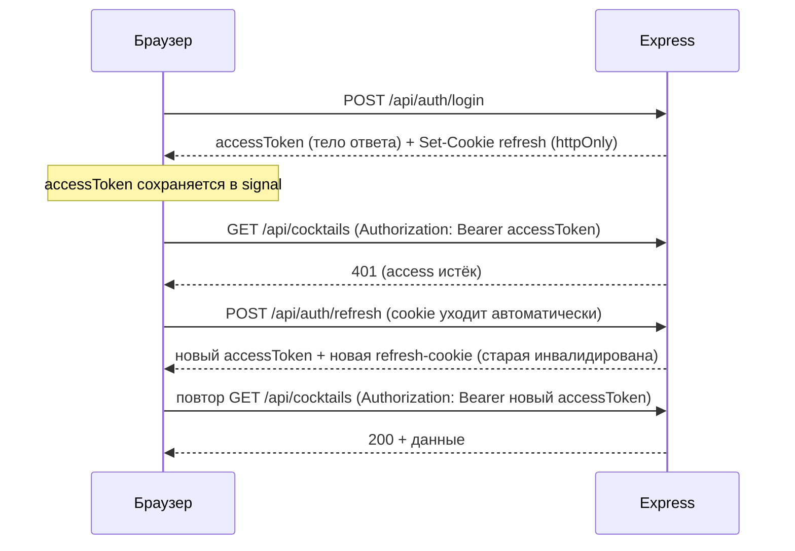

# Барная карта

## Содержание

- [Требования](#Требования)
- [Демонстрация работы (скриншоты)](#демонстрация-работы-скриншоты)
- [Технологии](#технологии)
- [Быстрый старт](#быстрый-старт)
- [Переменные окружения](#переменные-окружения)
- [Архитектура](#архитектура)
- [API](#api)
- [Тестирование](#тестирование)
- [Docker](#docker)
- [Итоги](#итоги)

## Требования

Необходимо создать приложение, которое будет отображать список рецептов коктейлей.
Должны быть все операции CRUD.

### Создание/редактирование рецепта коктейля

- Должны быть поля имени, описания коктейля.
- Должно быть описание процесса приготовления.
- Нужно иметь возможность сохранить картинки для каждого шага или картинку итогового результата.

### Просмотр общего списка коктейлей.

Нужна таблица с отображением даты добавления рецепта, названия, картинки готового коктейля (если задана при создании/редактировании).

### Дополнительно

- Использовать любой доступный способ хранения информации (localStorage, firebase, state manager, json файлы с локальным бэком).
- Если используется SSR – проверять, что он будет работать при чистой установке отдельного проекта.
- Можно сделать авторизацию.

## Демонстрация работы (скриншоты)










## Технологии

| Слой            | Технология                                                  |
| --------------- | ----------------------------------------------------------- |
| Frontend        | Angular 21                                                  |
| UI-кит          | Angular Material (M3), кастомная тема из своего hex-seed    |
| Состояние       | Сигналы (`signal`/`computed`)                               |
| Backend         | Node.js + Express                                           |
| Хранилище       | JSON-файлы                                                  |
| Auth            | JWT (access, в памяти) + httpOnly refresh-cookie с ротацией |
| Тесты           | Vitest                                                      |
| Контейнеризация | Docker                                                      |

## Быстрый старт

Склонируйте репозиторий, создайте файл `.env` в директории `dev-server` на основе `.env.example` и запустите приложение с помощью Docker Compose:

```bash
git clone https://github.com/TaurineMerge/cocktail-recipes.git

cd cocktail-recipes
cp .env.example dev-server/.env

docker compose up --build
```

После запуска:

- клиентское приложение доступно по адресу `http://localhost:4200`;
- API — по адресу `http://localhost:3000/api`.

Пользовательские данные (пользователи, рецепты и refresh-сессии) хранятся в именованном Docker volume и сохраняются между пересборками контейнеров.

## Переменные окружения

Полный список находится в `.env.example` в корне проекта.

| Переменная             | Назначение                                                                 | Дефолт                                              |
| ---------------------- | -------------------------------------------------------------------------- | --------------------------------------------------- |
| `JWT_SECRET`           | Секрет подписи access-токенов                                              | dev-заглушка, необходимо заменить в production      |
| `ACCESS_TOKEN_TTL_S`   | Время жизни access-токена, в **секундах**                                  | `900` (15 минут)                                    |
| `REFRESH_TOKEN_TTL_MS` | Время жизни refresh-токена, в миллисекундах                                | `604800000` (7 дней)                                |
| `REFRESH_COOKIE_NAME`  | Имя httpOnly-cookie с refresh-токеном                                      | `cocktail-recipes-rc`                               |
| `CLIENT_ORIGIN`        | Origin фронтенда для CORS                                                  | `http://localhost:4200`                             |
| `PORT`                 | Порт Express                                                               | `3000`                                              |
| `LOG_LEVEL`            | `debug` / `info` / `warn` / `error` — минимальный уровень логов на сервере | `info`                                              |
| `COOKIE_SECURE`        | Включает/выключает флаг `Secure` у refresh-cookie                          | `false`, необходимо заменить на `true` в production |

## Архитектура

### Слои приложения

Архитектура разделяет UI, бизнес-логику и транспортный слой, благодаря чему компоненты не зависят от HTTP-реализации.



**Выбор Single Page Application (SPA):**
Приложение представляет собой личный кабинет: доступ к функциональности возможен только после авторизации, а весь контент зависит от текущего пользователя. В таком сценарии преимущества SSR (SEO и быстрая отдача публичных страниц) практически не используются, поэтому SPA является более простым и уместным решением.

**Слой репозиториев:**
Репозитории отделяют бизнес-логику приложения от способа получения данных. Компоненты работают с абстракцией и не зависят от конкретной реализации (HTTP, моки и т.д.).
В качестве контракта выбран абстрактный класс, а не интерфейс, поскольку интерфейсы TypeScript отсутствуют в рантайме и не могут использоваться как токены Angular DI. Абстрактный класс одновременно задаёт контракт и выступает токеном внедрения зависимостей, благодаря чему реализацию можно заменить одной записью в конфигурации без изменения потребителей.

**Express вместо json-server / Firebase**
Использование собственного сервера сделало архитектуру более прозрачной и позволило полностью контролировать логику авторизации и API. Собственный Express-сервер позволил добавить проверку JWT и защитить маршруты `/cocktails/*`, возвращая корректные ответы `401` и `403` в зависимости от ситуации.

### Авторизация



**Выбранная схема авторизации:**

- **Access-токен** хранится только в памяти приложения. Это снижает риск его кражи через XSS, поскольку он не сохраняется в `localStorage` или `sessionStorage`. После перезагрузки страницы токен восстанавливается через refresh.
- **Refresh-токен** представляет собой случайный непрозрачный идентификатор и хранится в `httpOnly` cookie, поэтому недоступен JavaScript. На сервере сохраняется только его SHA-256-хэш, а не сам токен.
- **Ротация refresh-токенов.** При каждом успешном запросе на `/refresh` предыдущий refresh-токен инвалидируется и выдаётся новая пара токенов. Это уменьшает последствия компрометации старого токена.
- **Logout** выполняет реальный отзыв сессии: соответствующая запись удаляется на сервере, после чего refresh-токен больше не может использоваться.

### Структура проекта

```
cocktail-recipes/
├── src/app/
│	│   ├── core/
│	│   │   ├── auth/                          # AuthService, AuthRepository/AuthApiService, guards (auth/guest), интерцепторы
│	│   │   ├── logging/                       # GlobalErrorHandler, http-error-логирование
│	│   │   └── theme/                         # ThemeService (light/dark)
│	│   ├── features/
│	│   │   ├── auth/
│	│   │   │   ├── auth-shell/                # сплит-лэйаут с переключателем Войти/Регистрация
│	│   │   │   ├── login/
│	│   │   │   └── register/
│	│   │   └── cocktails/
│	│   │       ├── cocktail.model.ts          # модели предметной области
│	│   │       ├── cocktail.repository.ts     # контракт репозитория
│	│   │       ├── cocktail-api.service.ts    # HTTP-реализация репозитория
│	│   │       ├── cocktails-list/            # таблица/карточки + сортировка
│	│   │       ├── cocktail-form/             # mat-stepper, создание/редактирование
│	│   │       └── cocktail-detail/           # просмотр
│	│   ├── shared/
│	│   │   ├── confirm-dialog/
│	│   │   ├── images/
│	│   │   │   ├── image-upload/              # одна картинка + сжатие через canvas
│	│   │   │   ├── image-collection-upload/   # несколько картинок (шаг рецепта)
│	│   │   │   └── image-compression.ts
│	│   │   ├── password-field/
│	|   |   ├── password-match-validator/
│	|   |   └── email-validator/
│   ├── styles/                                # Sass-partitials (@use), M3-тема, breakpoints
|   ├── main.ts
|   ├── styles.scss
|   └── index.html
├── dev-server/
│   ├── auth/                                  # /api/auth/*, логика JWT/refresh
│   ├── cocktails/                             # /api/cocktails/*, CRUD
│   ├── store/                                 # JSON-хранилище + сами файлы данных
│   ├── logger.js
│   └── Dockerfile
├── Dockerfile                                 # фронтенд (multi-stage, nginx)
├── nginx.conf
├── docker-compose.yml
└── .env.example
```

**Принцип разбивки**:

- `core`: Инфраструктурный слой приложения. Содержит сервисы и механизмы, существующие в единственном экземпляре и используемые во всём приложении: авторизацию, HTTP-интерцепторы, guards, обработку ошибок, управление темой и т.п.
- `features`: Функциональные области (feature slices). Каждая папка инкапсулирует всё, что относится к конкретному сценарию (`auth`, `cocktails`): компоненты, модели, репозитории и сервисы доступа к данным.
- `shared`: Переиспользуемые UI-компоненты, директивы, валидаторы и утилиты, не привязанные к конкретной предметной области и используемые несколькими feature-модулями.

## API

Базовые префиксы: `/api/auth/*`, `/api/cocktails/*`.

| Метод  | Путь                 | Auth           | Описание                                                                  |
| ------ | -------------------- | -------------- | ------------------------------------------------------------------------- |
| POST   | `/api/auth/register` | —              | Регистрация пользователя, выдача access-токена и установка refresh-cookie |
| POST   | `/api/auth/login`    | —              | Аутентификация, выдача access-токена и установка refresh-cookie           |
| POST   | `/api/auth/refresh`  | Refresh cookie | Ротация refresh-токена и выдача новой пары токенов                        |
| POST   | `/api/auth/logout`   | Refresh cookie | Отзыв текущей сессии (удаление refresh-записи)                            |
| GET    | `/api/cocktails`     | Bearer         | Получение списка рецептов текущего пользователя                           |
| GET    | `/api/cocktails/:id` | Bearer         | Получение рецепта текущего пользователя                                   |
| POST   | `/api/cocktails`     | Bearer         | Создание рецепта (ownerId определяется по access-токену)                  |
| PATCH  | `/api/cocktails/:id` | Bearer         | Частичное обновление рецепта (обновляются только разрешённые поля)        |
| DELETE | `/api/cocktails/:id` | Bearer         | Удаление рецепта текущего пользователя                                    |
| GET    | `/api/health`        | —              | Проверка доступности сервиса                                              |

## Тестирование

```bash
npm test
```

**Покрыто:**

- API-сервисы (`CocktailApiService`,`AuthApiService`) через `HttpTestingController`
- Стейт-сервисы (`CocktailsListService`, `AuthService`)
- Сортировка коктейлей
- HTTP-интерцепторы (`attachToken`, `refreshOnUnauthorized`)
- Route guard'ы (`auth`, `guest`)
- Валидаторы (`passwordMatchValidator`, `strictEmailValidator`)
- Все компоненты коктейлей (список/форма/детали)
- Компоненты регистрации и входа в аккаунт

## Docker

Проект запускается в двух контейнерах:

- Angular + Nginx
- Express API

Для хранения данных используется именованный Docker volume.

## Итоги

**Реализовано в рамках задания:**

- Полный CRUD рецептов коктейлей (название, описание, пошаговое приготовление с фотографиями каждого шага и итоговым изображением).
- Просмотр списка рецептов в виде таблицы с автоматическим переключением на карточки на мобильных устройствах.
- Авторизация на основе JWT с refresh-токенами в httpOnly cookie и их ротацией.
- Интерфейс полностью построен на Angular Material (Material 3).

**Дополнительно реализовано:**

- Сортировка рецептов
- Поддержка тёмной и светлой темы
- Адаптивный интерфейс.
- Автоматизированные тесты (Vitest) для сценариев авторизации, CRUD-слоя и ключевых компонентов.
- Контейнеризация приложения с помощью Docker и multi-stage сборки.
